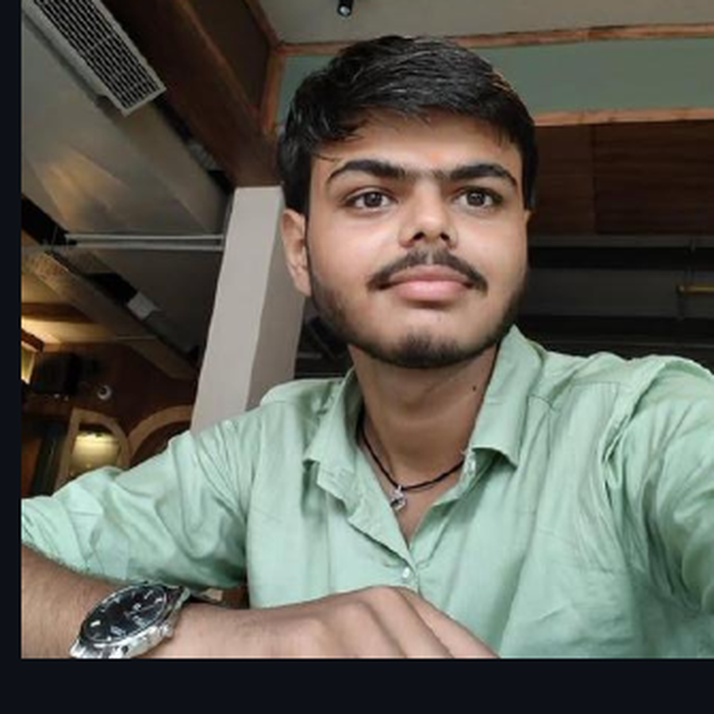
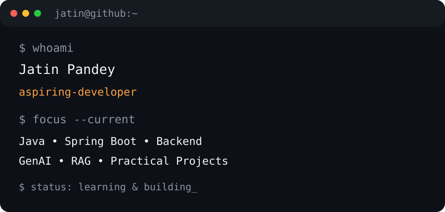

<div align="center">

# Jatin Pandey

### Aspiring Developer • Java • Spring Boot • Backend Development

<p>
  <a href="mailto:jatin45ppandey@gmail.com">
    
  </a>
  <a href="https://www.linkedin.com/in/jatin-pandey-a1654237a">
    
  </a>
  <a href="https://demo-portfolio-rho-sepia.vercel.app/">
    
  </a>
  <a href="https://www.instagram.com/jatin45p/">
    
  </a>
  <a href="https://github.com/jatin45ppandey-design">
    
  </a>
</p>

</div>

---

<table>
<tr>
<td width="58%" valign="top">

## 👨‍💻 `$ whoami`

Hi, I'm **Jatin Pandey**, an aspiring developer focused on building practical software projects and improving my problem-solving and development skills.

I'm currently pursuing **B.Tech in Computer Science & Engineering** at **Shri Ramswaroop Memorial College of Engineering & Management**.

My primary interests include:

- Backend development
- Java & Spring Boot
- Software engineering
- Database-driven applications
- AI-powered developer tools
- Building practical problem-solving projects

</td>

<td width="42%" align="center" valign="middle">



</td>
</tr>
</table>

---

## 🧑‍💻 Terminal

<div align="center">



</div>

---

## ⚡ Tech Stack

### Backend

<p>


</p>

### Frontend

<p>


</p>

### Database & Tools

<p>


</p>

---

# 🚀 Featured Projects

<table>
<tr>
<td width="50%" valign="top">

## 🌱 BhumiAI

**AI-assisted land-record digitization project**

A Hindi-English land-record processing prototype focused on converting scanned Khatauni-style documents into structured information.

**Highlights**

- Document/image preprocessing
- OCR-based field extraction
- Hindi + English document processing
- Confidence-based extraction
- Officer review and approval workflow
- Audit trail
- Cross-record validation

**Tech:** OpenCV • Pillow • Tesseract • Python

<p>
<a href="https://github.com/jatin45ppandey-design/BhumiAi">

</a>
</p>

</td>

<td width="50%" valign="top">

## 🧠 CodeSense

**AI-powered codebase intelligence**

A developer-focused application that connects with GitHub repositories, indexes codebases and lets developers understand and interact with their projects using AI.

**Highlights**

- GitHub authentication
- Repository synchronization
- Codebase indexing
- AI-powered codebase chat
- File-aware responses
- Developer dashboard

**Tech:** Next.js • Gemini • RAG • Render • Vercel

<p>
<a href="https://github.com/jatin45ppandey-design/Code-Sense">

</a>
</p>

</td>
</tr>

<tr>
<td width="50%" valign="top">

## 💳 PayVia

**UPI-inspired payment application**

A project exploring a digital payment/wallet workflow with a Spring Boot backend and PostgreSQL database.

**Tech:** Next.js • Spring Boot • PostgreSQL

</td>

<td width="50%" valign="top">

## 🛠️ More Projects

I'm continuously building and experimenting with projects across:

- Backend development
- Full-stack applications
- AI-assisted tools
- Database systems
- Developer productivity

<p>
<a href="https://github.com/jatin45ppandey-design?tab=repositories">

</a>
</p>

</td>
</tr>
</table>

---

# 🎓 Education

### B.Tech — Computer Science & Engineering

**Shri Ramswaroop Memorial College of Engineering & Management**

Currently developing skills across software development, backend technologies, databases and practical project building.

---

# 🧩 What I'm Exploring

```text
Java
 └── Spring Boot
      ├── REST APIs
      ├── Backend Architecture
      └── Database Integration

AI
 ├── GenAI
 ├── RAG
 └── AI-powered Developer Tools

Development
 ├── Full Stack Applications
 ├── PostgreSQL
 └── Software Engineering
```

---

# 📈 GitHub Activity

<div align="center">


<br>


</div>

---

# 🤝 Connect With Me

<div align="center">

<a href="mailto:jatin45ppandey@gmail.com">

</a>
<a href="https://www.linkedin.com/in/jatin-pandey-a1654237a">

</a>
<a href="https://demo-portfolio-rho-sepia.vercel.app/">

</a>
<a href="https://github.com/jatin45ppandey-design">

</a>

</div>

---

<div align="center">

### `Building. Learning. Improving.`

</div>
