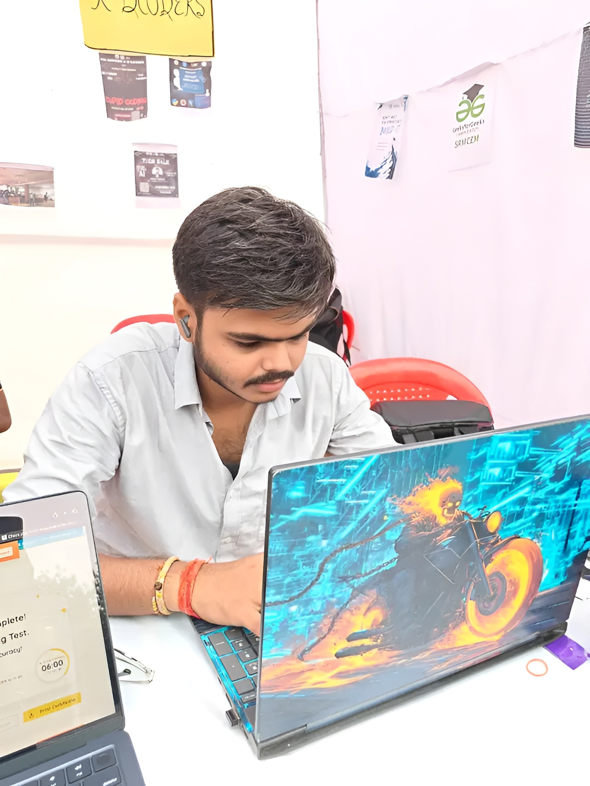

<div align="center">



<h1>Jatin Pandey</h1>

<p>
  <b>Backend-focused Developer</b><br>
  Java • Spring Boot • PostgreSQL • Practical Software Projects
</p>

<p>
  <a href="mailto:jatin45ppandey@gmail.com"></a>
  <a href="https://www.linkedin.com/in/jatin-pandey-a1654237a"></a>
  <a href="https://demo-portfolio-rho-sepia.vercel.app/"></a>
  <a href="https://github.com/jatin45ppandey-design"></a>
</p>


</div>

---

## `~/ whoami`

```text
name      : Jatin Pandey
role      : Backend-focused Developer
degree    : B.Tech — Computer Science & Engineering
college   : Shri Ramswaroop Memorial College of Engineering & Management

focus     : Java • Spring Boot • Backend Systems
building  : Practical software + AI-assisted developer tools
mindset   : Learn → Build → Improve → Repeat
```

## `$ cat about.txt`

I'm an aspiring developer focused on **backend development, Java, Spring Boot, databases, and practical software projects**.

I enjoy taking an idea from a rough concept to a working application, while continuously improving my problem-solving, software engineering, and system-building skills.

Right now, I'm especially interested in **backend architecture, REST APIs, PostgreSQL, full-stack systems, and useful AI-powered tools**.

---

## `$ ls skills/`

<div align="center">

**Backend**


**Frontend**


**Database & Tools**


</div>

---

## `$ ls projects/`

<table>
<tr>
<td width="50%" valign="top">

### 🌱 BhumiAI

**AI-assisted land-record digitization**

Prototype focused on converting scanned Hindi-English land records into structured, reviewable information.

**Highlights**
- Image/document preprocessing
- OCR-based field extraction
- Hindi + English processing
- Confidence-based extraction
- Officer review & approval
- Audit trail
- Cross-record validation

`OpenCV` `Pillow` `Tesseract` `Python`

<br>

<a href="https://github.com/jatin45ppandey-design/BhumiAi">

</a>

</td>

<td width="50%" valign="top">

### 🧠 CodeSense

**AI-powered codebase intelligence**

Developer-focused application that connects with GitHub repositories, indexes codebases, and lets developers understand projects using AI.

**Highlights**
- GitHub authentication
- Repository synchronization
- Codebase indexing
- AI-powered codebase chat
- File-aware responses
- Developer dashboard

`Next.js` `Gemini` `RAG` `Render` `Vercel`

<br>

<a href="https://github.com/jatin45ppandey-design/Code-Sense">

</a>
<a href="https://code-sense-phi-mocha.vercel.app/">

</a>

</td>
</tr>

<tr>
<td width="50%" valign="top">

### 💳 PayVia

**UPI-inspired payment application**

A project exploring a digital payment and wallet workflow with a Spring Boot backend and PostgreSQL database.

`Next.js` `Spring Boot` `PostgreSQL`

</td>

<td width="50%" valign="top">

### 🛠 More Projects

Currently experimenting with:

- Backend systems
- Full-stack applications
- AI-assisted tools
- Database-driven projects
- Developer productivity ideas

<a href="https://github.com/jatin45ppandey-design?tab=repositories">

</a>

</td>
</tr>
</table>

---

## `$ cat currently-exploring.md`

```text
→ Spring Boot & REST API architecture
→ PostgreSQL & backend systems
→ RAG & GenAI applications
→ Full-stack development
→ Better software design through real projects
```

---

## `$ git status`

<div align="center">


</div>

---

## `$ contact --me`

<div align="center">

**Have an idea, project, or something worth building?**

<br>

<a href="mailto:jatin45ppandey@gmail.com">

</a>
<a href="https://www.linkedin.com/in/jatin-pandey-a1654237a">

</a>
<a href="https://demo-portfolio-rho-sepia.vercel.app/">

</a>

<br><br>

`BUILDING • LEARNING • IMPROVING`

</div>
