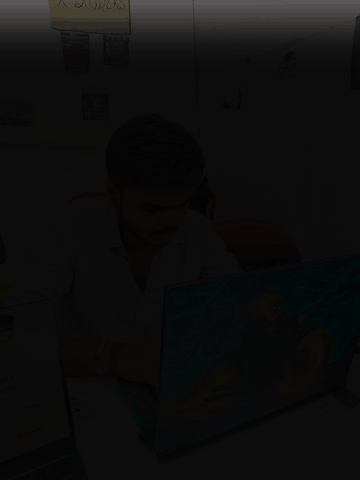

<h1>Jatin Pandey</h1>

  <b>Backend-focused Developer</b> 
  Java • Spring Boot • PostgreSQL • Practical Software Projects

  Aspiring developer focused on backend systems, software engineering, and building useful real-world applications. 
  I enjoy turning ideas into working software while improving my problem-solving and development skills.

  
  
  
  

---

## ⚡ Tech Stack

**Backend**  

**Frontend**  

**Database & Tools**  

---

## 🚀 Featured Projects

<table>
<tr>
<td width="50%" valign="top">

### 🌱 BhumiAI

**AI-assisted land-record digitization**

Hindi-English land-record processing prototype focused on converting scanned Khatauni-style documents into structured information.

**Highlights**
- Document/image preprocessing
- OCR-based field extraction
- Hindi + English processing
- Confidence-based extraction
- Officer review & approval
- Audit trail
- Cross-record validation

`OpenCV` `Pillow` `Tesseract` `Python`

 

</td>

<td width="50%" valign="top">

### 🧠 CodeSense

**AI-powered codebase intelligence**

Developer-focused application that connects with GitHub repositories, indexes codebases and lets developers understand and interact with projects using AI.

**Highlights**
- GitHub authentication
- Repository synchronization
- Codebase indexing
- AI-powered codebase chat
- File-aware responses
- Developer dashboard

`Next.js` `Gemini` `RAG` `Render` `Vercel`

 

</td>
</tr>

<tr>
<td width="50%" valign="top">

### 💳 PayVia

**UPI-inspired payment application**

A project exploring a digital payment/wallet workflow with a Spring Boot backend and PostgreSQL database.

`Next.js` `Spring Boot` `PostgreSQL`

</td>

<td width="50%" valign="top">

### 🛠️ More Projects

Continuously building and experimenting with:

- Backend development
- Full-stack applications
- AI-assisted tools
- Database systems
- Developer productivity

</td>
</tr>
</table>

---

## 🎓 Education

**B.Tech — Computer Science & Engineering**  
**Shri Ramswaroop Memorial College of Engineering & Management**

Currently developing skills across software development, backend technologies, databases and practical project building.

---

## 🧩 Currently Exploring

- Spring Boot & REST API architecture
- PostgreSQL & backend systems
- RAG & GenAI applications
- Full-stack development

---

## 📈 GitHub Activity

 

---

### Let's build something useful.

  

